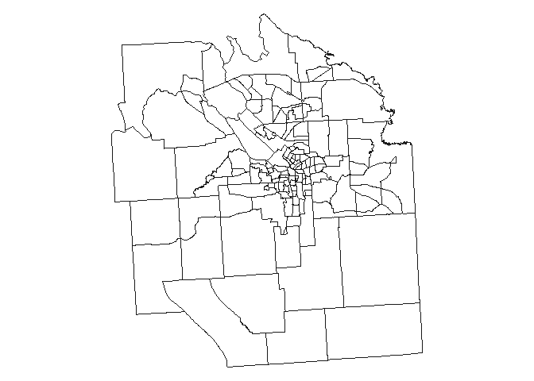
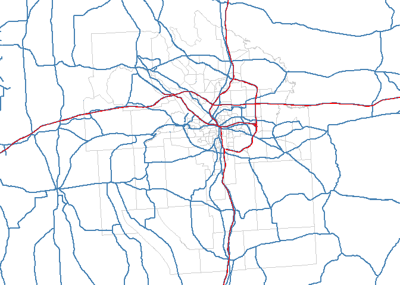
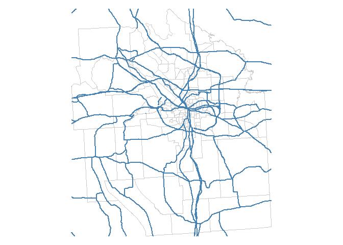
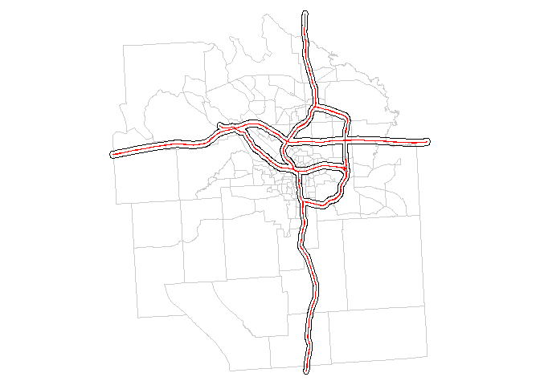
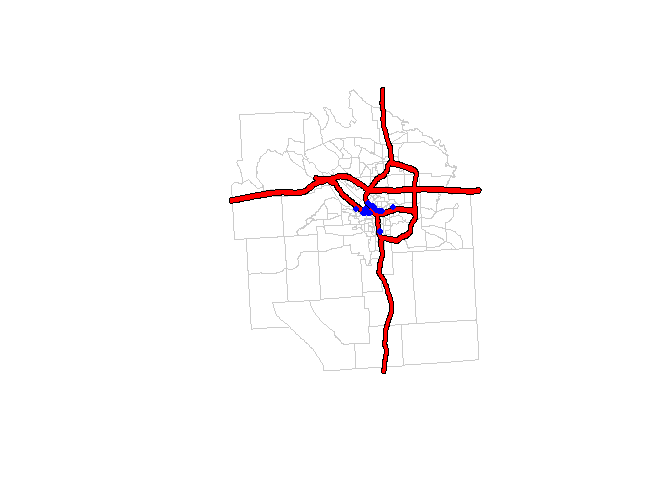
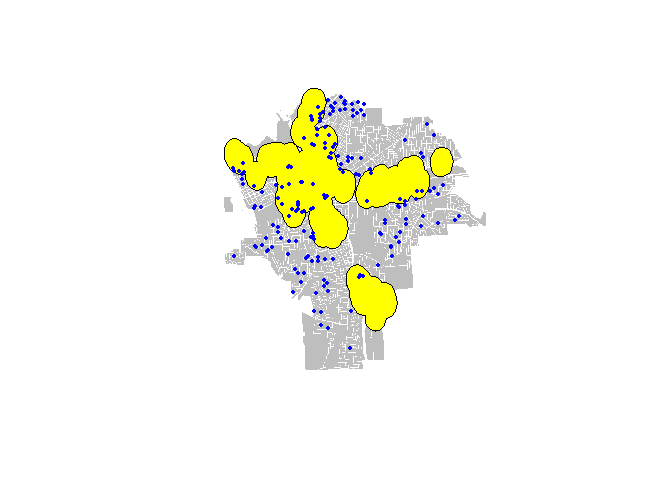
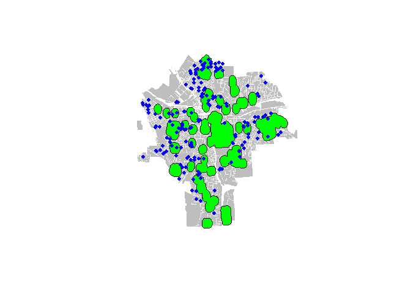

Lab 6
================
Linnea Powell
March 9, 2017

### load libraries

``` r
library( maptools )
library( sp )
library(raster)
library(rgeos)
library(dplyr)
library( spatialEco )
library( rgdal )
library( geojsonio )
library(maps)
```

Part 1
------

### download onondaga census tracts

``` r
download.file("ftp://ftp2.census.gov/geo/tiger/TIGER2010/TRACT/2010/tl_2010_36067_tract10.zip", "onondaga census tracts.zip" )

unzip( "onondaga census tracts.zip" )

file.remove( "onondaga census tracts.zip" )
```

    ## [1] TRUE

``` r
#dir()
```

### load and plot your shapefile

``` r
syr <- readShapePoly( fn="tl_2010_36067_tract10", proj4string=CRS("+proj=longlat +datum=WGS84") )

par( mar=c(0,0,0,0) )
plot( syr,  border="gray10" )
```



### add roads

``` r
download.file("ftp://ftp2.census.gov/geo/tiger/TIGER2015/PRISECROADS/tl_2015_36_prisecroads.zip", "primary_and_secondary_roads.zip" )

unzip( "primary_and_secondary_roads.zip" )

file.remove( "primary_and_secondary_roads.zip" )
```

    ## [1] TRUE

``` r
roads <- readShapeLines( fn="tl_2015_36_prisecroads", proj4string=CRS("+proj=longlat +datum=WGS84") )

head( roads@data )
```

    ##        LINEARID                    FULLNAME RTTYP MTFCC
    ## 0 1104486676574 Ny St Thruway Berkshire Exd     M S1200
    ## 1 1104493254230               Center St Exd     M S1200
    ## 2 1104492126212                  Oak St Exd     M S1200
    ## 3  110788145083                 Main St Exd     M S1200
    ## 4  110788617875              Gilbert St Exd     M S1200
    ## 5  110496874399              Forest Ave Exd     M S1200

``` r
table( roads$RTTYP )
```

    ## 
    ##    C    I    M    O    S    U 
    ##  826  268 7009   40 2774  473

### extract interstates

``` r
par( mar=c(0,0,0,0) )
plot( syr,  border="gray80" )
plot( roads, col="steelblue", lwd=2, add=T )

interstate <- roads[ roads$RTTYP == "I" , ]
plot( interstate, col="red", add=T )
```



### clip shapefile

``` r
gClip <- function(shp, bb){
if(class(bb) == "matrix") b_poly <- as(extent(as.vector(t(bb))), "SpatialPolygons")
else b_poly <- as(extent(bb), "SpatialPolygons")
gIntersection(shp, b_poly, byid = T)
}

roads_clipped <- gClip(roads, syr)

par( mar=c(0,0,0,0) )
plot( syr,  border="gray80" )
plot( roads_clipped, col="steelblue", lwd=2, add=T )
```



### extract interstates as a separate layer

``` r
interstate <- roads[ roads$RTTYP == "I" , ]
```

### create interstate buffer

``` r
interstate_clipped <- gClip(interstate, syr)

par( mar=c(0,0,0,0) )
plot( syr, border="gray80" )
plot( interstate_clipped, col="red", add=T)

buff1 <- gBuffer(interstate_clipped, width = .005, byid=FALSE)
plot(buff1, add=T)
```



### identify all houses within zone and add new variable

``` r
house.dat <- read.csv("https://raw.githubusercontent.com/lecy/hedonic-prices/master/Data/Housing%20Price%20In-Class%20Exercise%20(Responses).csv")
#head(house.dat)
lat.long <- read.csv ("https://raw.githubusercontent.com/lecy/hedonic-prices/master/Data/lat.long.csv")

lat.long2<-SpatialPoints(lat.long, proj4string=CRS("+proj=longlat +datum=WGS84"))
matchpointstobuffer <- over(lat.long2, buff1 )
matchpointstobuffer[is.na(matchpointstobuffer)] <- 0
inZone <-matchpointstobuffer==1
inZone
```

    ##     1     2     3     4     5     6     7     8     9    10    11    12 
    ## FALSE FALSE FALSE FALSE FALSE FALSE FALSE FALSE FALSE FALSE FALSE FALSE 
    ##    13    14    15    16    17    18    19    20    21    22    23    24 
    ## FALSE FALSE FALSE FALSE FALSE FALSE FALSE FALSE FALSE FALSE FALSE FALSE 
    ##    25    26    27    28    29    30    31    32    33    34    35    36 
    ## FALSE FALSE FALSE FALSE  TRUE FALSE FALSE FALSE FALSE FALSE FALSE FALSE 
    ##    37    38    39    40    41    42    43    44    45    46    47    48 
    ## FALSE FALSE FALSE FALSE FALSE FALSE FALSE  TRUE  TRUE  TRUE  TRUE FALSE 
    ##    49    50    51    52    53    54    55    56    57    58    59    60 
    ## FALSE FALSE FALSE FALSE FALSE FALSE FALSE FALSE FALSE FALSE FALSE FALSE 
    ##    61    62    63    64    65    66    67    68    69    70    71    72 
    ## FALSE FALSE FALSE FALSE FALSE FALSE FALSE FALSE FALSE FALSE FALSE FALSE 
    ##    73    74    75    76    77    78    79    80    81    82    83    84 
    ## FALSE FALSE FALSE FALSE FALSE FALSE FALSE FALSE FALSE FALSE  TRUE  TRUE 
    ##    85    86    87    88    89    90    91    92    93    94    95    96 
    ## FALSE  TRUE FALSE FALSE FALSE FALSE FALSE FALSE FALSE FALSE FALSE FALSE 
    ##    97    98    99   100   101   102   103   104   105   106   107   108 
    ## FALSE FALSE  TRUE FALSE FALSE  TRUE FALSE FALSE FALSE FALSE  TRUE FALSE 
    ##   109   110   111   112   113   114   115   116   117   118   119   120 
    ## FALSE FALSE FALSE FALSE FALSE FALSE FALSE FALSE FALSE FALSE FALSE FALSE 
    ##   121   122   123   124   125   126   127   128   129   130   131   132 
    ## FALSE FALSE FALSE FALSE FALSE FALSE FALSE FALSE FALSE FALSE FALSE FALSE 
    ##   133   134   135   136   137   138   139   140   141   142   143   144 
    ## FALSE  TRUE FALSE FALSE FALSE FALSE FALSE FALSE FALSE FALSE  TRUE  TRUE 
    ##   145   146   147   148   149   150   151   152   153   154   155   156 
    ##  TRUE FALSE FALSE FALSE FALSE FALSE FALSE FALSE FALSE FALSE FALSE FALSE 
    ##   157   158   159   160   161   162   163   164   165   166   167   168 
    ## FALSE  TRUE FALSE FALSE FALSE FALSE FALSE FALSE FALSE  TRUE FALSE FALSE 
    ##   169   170   171   172   173   174   175   176   177   178   179   180 
    ## FALSE FALSE  TRUE FALSE  TRUE  TRUE FALSE  TRUE  TRUE FALSE  TRUE  TRUE 
    ##   181   182   183   184   185   186   187   188   189 
    ## FALSE  TRUE FALSE FALSE FALSE FALSE FALSE FALSE FALSE

``` r
dathouse <- as.data.frame(house.dat )
#dat.buffer <- cbind( dathouse, inZone)#problem with differing number of rows

house.dat.buffer<- merge(dathouse, inZone)

plot( syr, border="gray80" )
plot(buff1, col="red", add=T)
points(lat.long2$lon[inZone], lat.long2$lat[inZone], col="blue", pch=19, cex=.8)
```



Part 2
------

### load geojson file

``` r
syr.geo <- readOGR(dsn="C:/Users/powel/Documents/Data 2/syr_parcels.geojson", layer="OGRGeoJSON") 
```

    ## OGR data source with driver: GeoJSON 
    ## Source: "C:/Users/powel/Documents/Data 2/syr_parcels.geojson", layer: "OGRGeoJSON"
    ## with 41502 features
    ## It has 64 fields

### Industrial Zones - create buffer, plot it, identify houses within it, create new variable

``` r
industrial_zone <- syr.geo[syr.geo$LandUse=="Industrial", ]
other_zones <- syr.geo[syr.geo$LandUse!="Industrial", ]

plot(other_zones, col = "grey", border = F)
plot(industrial_zone, add = T, col = "blue", border = F)

industrialBuffer <- gBuffer(industrial_zone, width = .005)
plot(industrialBuffer, add = T, col = "yellow")
points(lat.long2$lon, lat.long2$lat, col="blue", pch=19, cex=.5)
```



``` r
industrialBuffer.proj<- spTransform(industrialBuffer, CRS("+proj=longlat +datum=WGS84"))
industrial_over <- over(lat.long2, industrialBuffer.proj)

industrial_over[is.na(industrial_over)] <- 0
in_industrial_zone <-industrial_over==1
dathouse_with_indzone <- merge(dathouse, in_industrial_zone)
head(dathouse_with_indzone)
```

    ##         Timestamp House.Price  X X.1 Square.Feet      Your.Name
    ## 1 1/15/2015 16:11  179,900.00 NA  NA    1,600.00 Emily Simonson
    ## 2 1/15/2015 16:17  128,000.00 NA  NA    1,992.00 Emily Simonson
    ## 3 1/15/2015 16:25  114,900.00 NA  NA    1,378.00 Emily Simonson
    ## 4 1/15/2015 16:34  107,500.00 NA  NA    1,452.00 Emily Simonson
    ## 5 1/15/2015 16:41   43,000.00 NA  NA         850 Emily Simonson
    ## 6 1/15/2015 16:52   85,000.00 NA  NA    1,639.00 Emily Simonson
    ##   Lot.Size..in.SQUARE.FEET. Number.of.Bedrooms Number.of.Bathrooms
    ## 1                 43,560.00                  3                 2.0
    ## 2                  6,969.00                  4                 2.5
    ## 3                  5,227.00                  4                 1.0
    ## 4                  5,227.00                  3                 1.0
    ## 5                  6,098.00                  2                 1.0
    ## 6                  7,840.00                  4                 1.0
    ##   Does.it.have.a.garage. Year.Built Elementary.School.Score
    ## 1                    Yes       1994                       9
    ## 2                    Yes       1950                       2
    ## 3                    Yes       1930                       2
    ## 4                    Yes       1931                       2
    ## 5                    Yes       1955                       2
    ## 6                     No       1915                       2
    ##   Middle.School.Score High.School.Score Walk.Score Property.Taxes
    ## 1                   4                 2         15       3,182.00
    ## 2                   4                 2         43       1,393.00
    ## 3                   4                 2         50       1,331.00
    ## 4                   4                 1         42            157
    ## 5                   9                 1         57       1,525.00
    ## 6                   4                 1         36       2,184.00
    ##   Is.it.within.two.blocks.of.a.highway.or.interstate.
    ## 1                                                  No
    ## 2                                                  No
    ## 3                                                  No
    ## 4                                                  No
    ## 5                                                  No
    ## 6                                                  No
    ##   Walking.distance.to.the.nearest.good.restaurant...in.MINUTES...
    ## 1                                                              22
    ## 2                                                               7
    ## 3                                                               6
    ## 4                                                              12
    ## 5                                                               8
    ## 6                                                              32
    ##   Driving.distance.to.the.nearest.Starbucks...in.MILES...
    ## 1                                                     3.2
    ## 2                                                     2.6
    ## 3                                                     2.6
    ## 4                                                     2.6
    ## 5                                                     2.3
    ## 6                                                     1.9
    ##   Walking.distance.to.the.nearest.large.park..at.least.4.square.blocks..in.MINUTES.
    ## 1                                                                                18
    ## 2                                                                                 5
    ## 3                                                                                 7
    ## 4                                                                                 8
    ## 5                                                                                20
    ## 6                                                                                11
    ##   Driving.distance.to.the.nearest.strip.or.shopping.mall...in.MILES...
    ## 1                                                                  1.3
    ## 2                                                                  0.6
    ## 3                                                                  0.5
    ## 4                                                                  0.8
    ## 5                                                                  0.6
    ## 6                                                                  2.5
    ##   Street.Address.of.House Zip.Code
    ## 1      504 Winkworth Pkwy    13219
    ## 2          136 Austin Ave    13207
    ## 3          701 Velasko Rd    13207
    ## 4         518 Wolcott Ave    13207
    ## 5         112 Wolcott Ave    13207
    ## 6         212 Roberts Ave    13207
    ##   The.Census.Tract.in.which.the.house.resides.     y
    ## 1                                           NA FALSE
    ## 2                                           NA FALSE
    ## 3                                           NA FALSE
    ## 4                                           NA FALSE
    ## 5                                           NA FALSE
    ## 6                                           NA FALSE

``` r
names(dathouse_with_indzone)[names(dathouse_with_indzone)=="y"] <- "In Industrial Zone"
head(dathouse_with_indzone)
```

    ##         Timestamp House.Price  X X.1 Square.Feet      Your.Name
    ## 1 1/15/2015 16:11  179,900.00 NA  NA    1,600.00 Emily Simonson
    ## 2 1/15/2015 16:17  128,000.00 NA  NA    1,992.00 Emily Simonson
    ## 3 1/15/2015 16:25  114,900.00 NA  NA    1,378.00 Emily Simonson
    ## 4 1/15/2015 16:34  107,500.00 NA  NA    1,452.00 Emily Simonson
    ## 5 1/15/2015 16:41   43,000.00 NA  NA         850 Emily Simonson
    ## 6 1/15/2015 16:52   85,000.00 NA  NA    1,639.00 Emily Simonson
    ##   Lot.Size..in.SQUARE.FEET. Number.of.Bedrooms Number.of.Bathrooms
    ## 1                 43,560.00                  3                 2.0
    ## 2                  6,969.00                  4                 2.5
    ## 3                  5,227.00                  4                 1.0
    ## 4                  5,227.00                  3                 1.0
    ## 5                  6,098.00                  2                 1.0
    ## 6                  7,840.00                  4                 1.0
    ##   Does.it.have.a.garage. Year.Built Elementary.School.Score
    ## 1                    Yes       1994                       9
    ## 2                    Yes       1950                       2
    ## 3                    Yes       1930                       2
    ## 4                    Yes       1931                       2
    ## 5                    Yes       1955                       2
    ## 6                     No       1915                       2
    ##   Middle.School.Score High.School.Score Walk.Score Property.Taxes
    ## 1                   4                 2         15       3,182.00
    ## 2                   4                 2         43       1,393.00
    ## 3                   4                 2         50       1,331.00
    ## 4                   4                 1         42            157
    ## 5                   9                 1         57       1,525.00
    ## 6                   4                 1         36       2,184.00
    ##   Is.it.within.two.blocks.of.a.highway.or.interstate.
    ## 1                                                  No
    ## 2                                                  No
    ## 3                                                  No
    ## 4                                                  No
    ## 5                                                  No
    ## 6                                                  No
    ##   Walking.distance.to.the.nearest.good.restaurant...in.MINUTES...
    ## 1                                                              22
    ## 2                                                               7
    ## 3                                                               6
    ## 4                                                              12
    ## 5                                                               8
    ## 6                                                              32
    ##   Driving.distance.to.the.nearest.Starbucks...in.MILES...
    ## 1                                                     3.2
    ## 2                                                     2.6
    ## 3                                                     2.6
    ## 4                                                     2.6
    ## 5                                                     2.3
    ## 6                                                     1.9
    ##   Walking.distance.to.the.nearest.large.park..at.least.4.square.blocks..in.MINUTES.
    ## 1                                                                                18
    ## 2                                                                                 5
    ## 3                                                                                 7
    ## 4                                                                                 8
    ## 5                                                                                20
    ## 6                                                                                11
    ##   Driving.distance.to.the.nearest.strip.or.shopping.mall...in.MILES...
    ## 1                                                                  1.3
    ## 2                                                                  0.6
    ## 3                                                                  0.5
    ## 4                                                                  0.8
    ## 5                                                                  0.6
    ## 6                                                                  2.5
    ##   Street.Address.of.House Zip.Code
    ## 1      504 Winkworth Pkwy    13219
    ## 2          136 Austin Ave    13207
    ## 3          701 Velasko Rd    13207
    ## 4         518 Wolcott Ave    13207
    ## 5         112 Wolcott Ave    13207
    ## 6         212 Roberts Ave    13207
    ##   The.Census.Tract.in.which.the.house.resides. In Industrial Zone
    ## 1                                           NA              FALSE
    ## 2                                           NA              FALSE
    ## 3                                           NA              FALSE
    ## 4                                           NA              FALSE
    ## 5                                           NA              FALSE
    ## 6                                           NA              FALSE

### Schools - create buffer, plot it, identify houses within it, create new variable

``` r
schools <- syr.geo[syr.geo$LandUse=="Schools", ]
not_schools <- syr.geo[syr.geo$LandUse!="Schools", ]

plot(not_schools, col = "grey", border = F)
plot(schools, add = T, col = "blue", border = F)

schoolBuffer <- gBuffer(schools, width = .0025)
plot(schoolBuffer, add = T, col = "green")
points(lat.long2$lon, lat.long2$lat, col="blue", pch=19, cex=.8)
```



``` r
schoolBuffer.proj<- spTransform(schoolBuffer, CRS("+proj=longlat +datum=WGS84"))
schools_over <- over(lat.long2, schoolBuffer.proj)
schools_over[is.na(schools_over)] <- 0
near_school <-schools_over==1
dathouse_with_near_school <- merge(dathouse, near_school)
head(dathouse_with_near_school)
```

    ##         Timestamp House.Price  X X.1 Square.Feet      Your.Name
    ## 1 1/15/2015 16:11  179,900.00 NA  NA    1,600.00 Emily Simonson
    ## 2 1/15/2015 16:17  128,000.00 NA  NA    1,992.00 Emily Simonson
    ## 3 1/15/2015 16:25  114,900.00 NA  NA    1,378.00 Emily Simonson
    ## 4 1/15/2015 16:34  107,500.00 NA  NA    1,452.00 Emily Simonson
    ## 5 1/15/2015 16:41   43,000.00 NA  NA         850 Emily Simonson
    ## 6 1/15/2015 16:52   85,000.00 NA  NA    1,639.00 Emily Simonson
    ##   Lot.Size..in.SQUARE.FEET. Number.of.Bedrooms Number.of.Bathrooms
    ## 1                 43,560.00                  3                 2.0
    ## 2                  6,969.00                  4                 2.5
    ## 3                  5,227.00                  4                 1.0
    ## 4                  5,227.00                  3                 1.0
    ## 5                  6,098.00                  2                 1.0
    ## 6                  7,840.00                  4                 1.0
    ##   Does.it.have.a.garage. Year.Built Elementary.School.Score
    ## 1                    Yes       1994                       9
    ## 2                    Yes       1950                       2
    ## 3                    Yes       1930                       2
    ## 4                    Yes       1931                       2
    ## 5                    Yes       1955                       2
    ## 6                     No       1915                       2
    ##   Middle.School.Score High.School.Score Walk.Score Property.Taxes
    ## 1                   4                 2         15       3,182.00
    ## 2                   4                 2         43       1,393.00
    ## 3                   4                 2         50       1,331.00
    ## 4                   4                 1         42            157
    ## 5                   9                 1         57       1,525.00
    ## 6                   4                 1         36       2,184.00
    ##   Is.it.within.two.blocks.of.a.highway.or.interstate.
    ## 1                                                  No
    ## 2                                                  No
    ## 3                                                  No
    ## 4                                                  No
    ## 5                                                  No
    ## 6                                                  No
    ##   Walking.distance.to.the.nearest.good.restaurant...in.MINUTES...
    ## 1                                                              22
    ## 2                                                               7
    ## 3                                                               6
    ## 4                                                              12
    ## 5                                                               8
    ## 6                                                              32
    ##   Driving.distance.to.the.nearest.Starbucks...in.MILES...
    ## 1                                                     3.2
    ## 2                                                     2.6
    ## 3                                                     2.6
    ## 4                                                     2.6
    ## 5                                                     2.3
    ## 6                                                     1.9
    ##   Walking.distance.to.the.nearest.large.park..at.least.4.square.blocks..in.MINUTES.
    ## 1                                                                                18
    ## 2                                                                                 5
    ## 3                                                                                 7
    ## 4                                                                                 8
    ## 5                                                                                20
    ## 6                                                                                11
    ##   Driving.distance.to.the.nearest.strip.or.shopping.mall...in.MILES...
    ## 1                                                                  1.3
    ## 2                                                                  0.6
    ## 3                                                                  0.5
    ## 4                                                                  0.8
    ## 5                                                                  0.6
    ## 6                                                                  2.5
    ##   Street.Address.of.House Zip.Code
    ## 1      504 Winkworth Pkwy    13219
    ## 2          136 Austin Ave    13207
    ## 3          701 Velasko Rd    13207
    ## 4         518 Wolcott Ave    13207
    ## 5         112 Wolcott Ave    13207
    ## 6         212 Roberts Ave    13207
    ##   The.Census.Tract.in.which.the.house.resides.     y
    ## 1                                           NA FALSE
    ## 2                                           NA FALSE
    ## 3                                           NA FALSE
    ## 4                                           NA FALSE
    ## 5                                           NA FALSE
    ## 6                                           NA FALSE

``` r
names(dathouse_with_near_school)[names(dathouse_with_near_school)=="y"] <- "Near School"
head(dathouse_with_indzone)
```

    ##         Timestamp House.Price  X X.1 Square.Feet      Your.Name
    ## 1 1/15/2015 16:11  179,900.00 NA  NA    1,600.00 Emily Simonson
    ## 2 1/15/2015 16:17  128,000.00 NA  NA    1,992.00 Emily Simonson
    ## 3 1/15/2015 16:25  114,900.00 NA  NA    1,378.00 Emily Simonson
    ## 4 1/15/2015 16:34  107,500.00 NA  NA    1,452.00 Emily Simonson
    ## 5 1/15/2015 16:41   43,000.00 NA  NA         850 Emily Simonson
    ## 6 1/15/2015 16:52   85,000.00 NA  NA    1,639.00 Emily Simonson
    ##   Lot.Size..in.SQUARE.FEET. Number.of.Bedrooms Number.of.Bathrooms
    ## 1                 43,560.00                  3                 2.0
    ## 2                  6,969.00                  4                 2.5
    ## 3                  5,227.00                  4                 1.0
    ## 4                  5,227.00                  3                 1.0
    ## 5                  6,098.00                  2                 1.0
    ## 6                  7,840.00                  4                 1.0
    ##   Does.it.have.a.garage. Year.Built Elementary.School.Score
    ## 1                    Yes       1994                       9
    ## 2                    Yes       1950                       2
    ## 3                    Yes       1930                       2
    ## 4                    Yes       1931                       2
    ## 5                    Yes       1955                       2
    ## 6                     No       1915                       2
    ##   Middle.School.Score High.School.Score Walk.Score Property.Taxes
    ## 1                   4                 2         15       3,182.00
    ## 2                   4                 2         43       1,393.00
    ## 3                   4                 2         50       1,331.00
    ## 4                   4                 1         42            157
    ## 5                   9                 1         57       1,525.00
    ## 6                   4                 1         36       2,184.00
    ##   Is.it.within.two.blocks.of.a.highway.or.interstate.
    ## 1                                                  No
    ## 2                                                  No
    ## 3                                                  No
    ## 4                                                  No
    ## 5                                                  No
    ## 6                                                  No
    ##   Walking.distance.to.the.nearest.good.restaurant...in.MINUTES...
    ## 1                                                              22
    ## 2                                                               7
    ## 3                                                               6
    ## 4                                                              12
    ## 5                                                               8
    ## 6                                                              32
    ##   Driving.distance.to.the.nearest.Starbucks...in.MILES...
    ## 1                                                     3.2
    ## 2                                                     2.6
    ## 3                                                     2.6
    ## 4                                                     2.6
    ## 5                                                     2.3
    ## 6                                                     1.9
    ##   Walking.distance.to.the.nearest.large.park..at.least.4.square.blocks..in.MINUTES.
    ## 1                                                                                18
    ## 2                                                                                 5
    ## 3                                                                                 7
    ## 4                                                                                 8
    ## 5                                                                                20
    ## 6                                                                                11
    ##   Driving.distance.to.the.nearest.strip.or.shopping.mall...in.MILES...
    ## 1                                                                  1.3
    ## 2                                                                  0.6
    ## 3                                                                  0.5
    ## 4                                                                  0.8
    ## 5                                                                  0.6
    ## 6                                                                  2.5
    ##   Street.Address.of.House Zip.Code
    ## 1      504 Winkworth Pkwy    13219
    ## 2          136 Austin Ave    13207
    ## 3          701 Velasko Rd    13207
    ## 4         518 Wolcott Ave    13207
    ## 5         112 Wolcott Ave    13207
    ## 6         212 Roberts Ave    13207
    ##   The.Census.Tract.in.which.the.house.resides. In Industrial Zone
    ## 1                                           NA              FALSE
    ## 2                                           NA              FALSE
    ## 3                                           NA              FALSE
    ## 4                                           NA              FALSE
    ## 5                                           NA              FALSE
    ## 6                                           NA              FALSE
