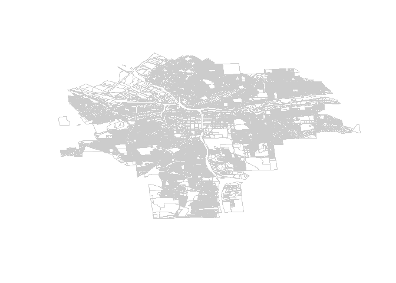
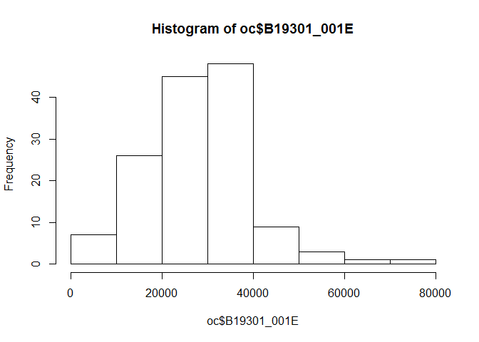
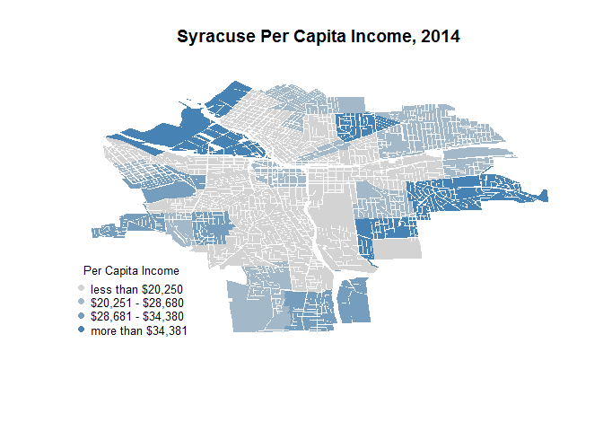
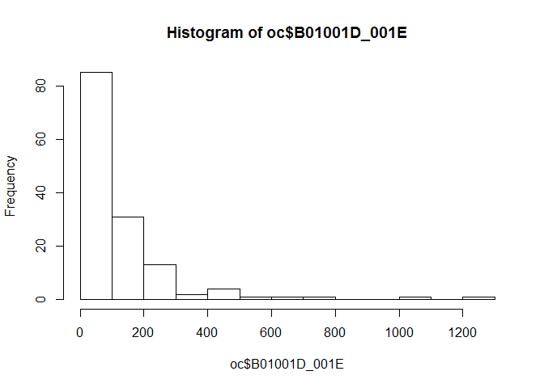
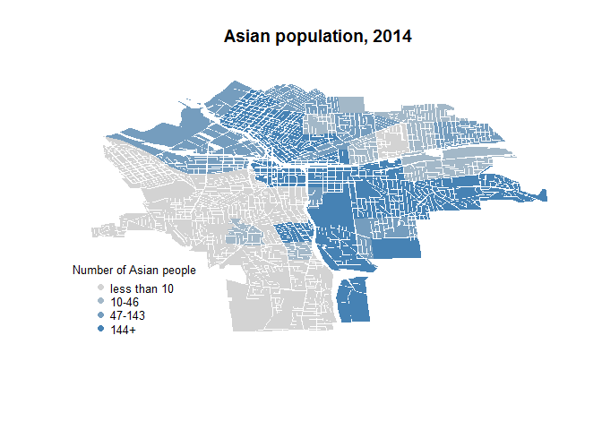
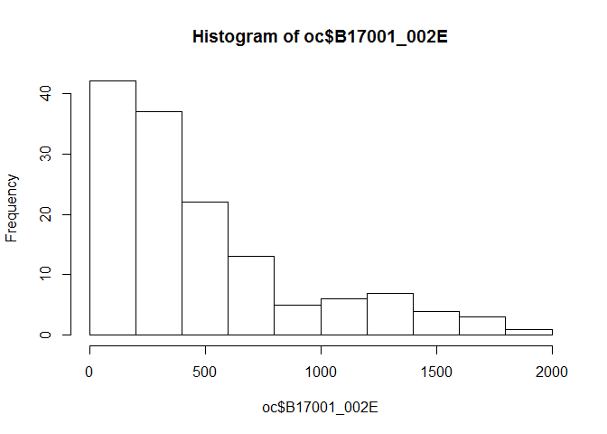
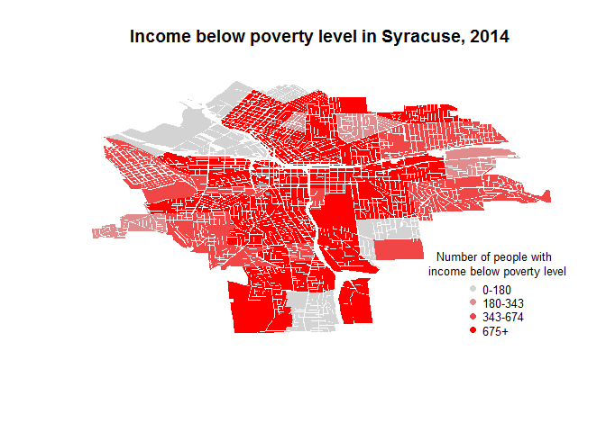

lab 3
================
Linnea Powell
February 9, 2017

load and plot shapefile
=======================

``` r
library( maptools )
library( sp )

syr <- readShapePoly( fn="01-05-2015", proj4string=CRS("+proj=longlat +datum=WGS84") )

plot( syr,  border="gray80" )
```



grab census data
================

``` r
devtools::install_github("hrecht/censusapi")
censuskey <- "b06146bd7469912826a96e117fcf4a8ab8bc36de"
library(censusapi)
```

select variables Per Capita Income, Asian population, Income &lt; poverty level last 12 months
==============================================================================================

``` r
myvars <- c("NAME", "B19301_001E", "B01001D_001E", "B17001_002E")
acs5_2014 <- getCensus(name="acs5", vintage=2014, key=censuskey,
    vars=myvars, region="tract:*", regionin="state:36")
head( acs5_2014 )
```

    ##                                         NAME state county  tract
    ## 1    Census Tract 1, Albany County, New York    36    001 000100
    ## 2    Census Tract 2, Albany County, New York    36    001 000200
    ## 3    Census Tract 3, Albany County, New York    36    001 000300
    ## 4 Census Tract 4.01, Albany County, New York    36    001 000401
    ## 5 Census Tract 4.03, Albany County, New York    36    001 000403
    ## 6 Census Tract 4.04, Albany County, New York    36    001 000404
    ##   B19301_001E B01001D_001E B17001_002E
    ## 1       18612           48         877
    ## 2       16624            8        2206
    ## 3       22048           86        1906
    ## 4       38497           53          72
    ## 5       33468          481        1018
    ## 6        2780          321           0

``` r
oc <- subset(acs5_2014, county == "067")
oc$newtract <- (as.numeric(oc$tract)/100)
head(oc)
```

    ##                                              NAME state county  tract
    ## 2813    Census Tract 1, Onondaga County, New York    36    067 000100
    ## 2814    Census Tract 2, Onondaga County, New York    36    067 000200
    ## 2815    Census Tract 3, Onondaga County, New York    36    067 000300
    ## 2816    Census Tract 4, Onondaga County, New York    36    067 000400
    ## 2817 Census Tract 5.01, Onondaga County, New York    36    067 000501
    ## 2818    Census Tract 6, Onondaga County, New York    36    067 000600
    ##      B19301_001E B01001D_001E B17001_002E newtract
    ## 2813       48954           65         129     1.00
    ## 2814       19304          213        1315     2.00
    ## 2815       22219          145         163     3.00
    ## 2816       25343          142         674     4.00
    ## 2817       11529          486         908     5.01
    ## 2818       11883          617        1578     6.00

Variable 1
==========

making color pallette for Per Capita Income
===========================================

``` r
color.function <- colorRampPalette( c("light gray","steel blue" ) )

col.ramp <- color.function( 4 )

color.vector <- cut( rank(oc$B19301_001E), breaks=4, label=col.ramp)

color.vector <- as.character( color.vector )
```

match up shapefile and census data
==================================

``` r
this.order <- match(syr$CensusTrac, oc$newtract )

color.vec.ordered <- color.vector[ this.order ]
```

get feel of Per Capita income (B19301\_001E)
============================================

``` r
summary(oc$B19301_001E)
```

    ##    Min. 1st Qu.  Median    Mean 3rd Qu.    Max. 
    ##    6999   20250   28680   27950   34380   77580

``` r
hist(oc$B19301_001E)
```



Graph Per Capita Income in Syracuse
===================================

``` r
plot( syr, col=color.vec.ordered, border=FALSE, main="Syracuse Per Capita Income, 2014" )

legend.text=c("less than $20,250" ,
              "$20,251 - $28,680",
              "$28,681 - $34,380",
              "more than $34,381")

legend( "bottomleft", bg="white",
        pch=20, pt.cex=1.5, cex=0.8,
        legend=legend.text, 
        col=col.ramp, 
        box.col="white",
        title="Per Capita Income" 
       )
```



Variable 2
==========

making color pallette for Asian population
==========================================

``` r
color.function <- colorRampPalette( c("light gray","steel blue" ) )

col.ramp <- color.function( 4 )

color.vector2 <- cut( rank(oc$B01001D_001E), breaks=4, label=col.ramp)

color.vector2 <- as.character( color.vector2 )

this.order <- match(syr$CensusTrac, oc$newtract )

color.vec.ordered2 <- color.vector2[ this.order ]
```

get feel of Asian population (B01001D\_001E)
============================================

``` r
summary(oc$B01001D_001E)
```

    ##    Min. 1st Qu.  Median    Mean 3rd Qu.    Max. 
    ##     0.0     9.0    46.0   115.6   142.5  1232.0

``` r
hist(oc$B01001D_001E)
```



Graph Asian population in Syracuse
==================================

``` r
plot( syr, col=color.vec.ordered2, border=FALSE, main="Asian population, 2014" )

legend.text=c("less than 10" ,
              "10-46",
              "47-143",
              "144+")

legend( "bottomleft", bg="white",
        pch=20, pt.cex=1.5, cex=0.8,
        legend=legend.text, 
        col=col.ramp, 
        box.col="white",
        title="Number of Asian people" 
       )
```



Variable 3
==========

making color pallette for Income &lt; poverty level last 12 months
==================================================================

``` r
color.function <- colorRampPalette( c("light gray","red" ) )

col.ramp <- color.function( 4 )

color.vector3 <- cut( rank(oc$B17001_002E), breaks=4, label=col.ramp)


color.vector3 <- as.character( color.vector3 )

this.order <- match(syr$CensusTrac, oc$newtract )

color.vec.ordered3 <- color.vector3[ this.order ]
```

get feel of Income &lt; poverty level last 12 months (B17001\_002E)
===================================================================

``` r
summary(oc$B17001_002E)
```

    ##    Min. 1st Qu.  Median    Mean 3rd Qu.    Max. 
    ##     0.0   178.8   343.0   489.7   674.0  1980.0

``` r
hist(oc$B17001_002E)
```



Graph Income &lt; poverty level last 12 months in Syracuse
==========================================================

``` r
plot( syr, col=color.vec.ordered3, border=FALSE, main="Income below poverty level in Syracuse, 2014" )

legend.text=c("0-180" ,
              "180-343",
              "343-674",
              "675+")

legend( "bottomright", bg="white",
        pch=20, pt.cex=1.5, cex=0.8,
        legend=legend.text, 
        col=col.ramp, 
        box.col="white",
        title="Number of people with \n income below poverty level" 
       )
```


