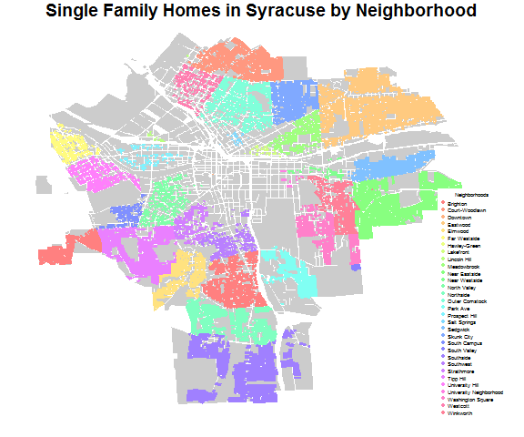

lab 4
================
Linnea Powell
February 14, 2017

load and plot shapefile
-----------------------

``` r
library( maptools )
library( sp )
library( dplyr )
library( pander )
syr <- readShapePoly( fn="01-05-2015", proj4string=CRS("+proj=longlat +datum=WGS84") )
```

Question 1: How many single family homes are in each neighborhood?
------------------------------------------------------------------

``` r
dat <- as.data.frame( syr )

subset.NL<- select(dat, Nhood, LandUse)

subset.single <- filter(subset.NL, LandUse=="Single Family" )

single.nhood <- count(subset.single, Nhood)

pander(single.nhood)
```

<table style="width:39%;">
<colgroup>
<col width="33%" />
<col width="5%" />
</colgroup>
<thead>
<tr class="header">
<th align="center">Nhood</th>
<th align="center">n</th>
</tr>
</thead>
<tbody>
<tr class="odd">
<td align="center">Brighton</td>
<td align="center">1398</td>
</tr>
<tr class="even">
<td align="center">Court-Woodlawn</td>
<td align="center">1859</td>
</tr>
<tr class="odd">
<td align="center">Downtown</td>
<td align="center">1</td>
</tr>
<tr class="even">
<td align="center">Eastwood</td>
<td align="center">3605</td>
</tr>
<tr class="odd">
<td align="center">Elmwood</td>
<td align="center">909</td>
</tr>
<tr class="even">
<td align="center">Far Westside</td>
<td align="center">471</td>
</tr>
<tr class="odd">
<td align="center">Hawley-Green</td>
<td align="center">52</td>
</tr>
<tr class="even">
<td align="center">Lakefront</td>
<td align="center">24</td>
</tr>
<tr class="odd">
<td align="center">Lincoln Hill</td>
<td align="center">580</td>
</tr>
<tr class="even">
<td align="center">Meadowbrook</td>
<td align="center">1721</td>
</tr>
<tr class="odd">
<td align="center">Near Eastside</td>
<td align="center">93</td>
</tr>
<tr class="even">
<td align="center">Near Westside</td>
<td align="center">521</td>
</tr>
<tr class="odd">
<td align="center">North Valley</td>
<td align="center">1194</td>
</tr>
<tr class="even">
<td align="center">Northside</td>
<td align="center">1508</td>
</tr>
<tr class="odd">
<td align="center">Outer Comstock</td>
<td align="center">697</td>
</tr>
<tr class="even">
<td align="center">Park Ave.</td>
<td align="center">167</td>
</tr>
<tr class="odd">
<td align="center">Prospect Hill</td>
<td align="center">29</td>
</tr>
<tr class="even">
<td align="center">Salt Springs</td>
<td align="center">1029</td>
</tr>
<tr class="odd">
<td align="center">Sedgwick</td>
<td align="center">892</td>
</tr>
<tr class="even">
<td align="center">Skunk City</td>
<td align="center">345</td>
</tr>
<tr class="odd">
<td align="center">South Campus</td>
<td align="center">25</td>
</tr>
<tr class="even">
<td align="center">South Valley</td>
<td align="center">1605</td>
</tr>
<tr class="odd">
<td align="center">Southside</td>
<td align="center">481</td>
</tr>
<tr class="even">
<td align="center">Southwest</td>
<td align="center">419</td>
</tr>
<tr class="odd">
<td align="center">Strathmore</td>
<td align="center">1475</td>
</tr>
<tr class="even">
<td align="center">Tipp Hill</td>
<td align="center">785</td>
</tr>
<tr class="odd">
<td align="center">University Hill</td>
<td align="center">17</td>
</tr>
<tr class="even">
<td align="center">University Neighborhood</td>
<td align="center">803</td>
</tr>
<tr class="odd">
<td align="center">Washington Square</td>
<td align="center">425</td>
</tr>
<tr class="even">
<td align="center">Westcott</td>
<td align="center">851</td>
</tr>
<tr class="odd">
<td align="center">Winkworth</td>
<td align="center">411</td>
</tr>
</tbody>
</table>

``` r
par(mar=c(1,1,1,1))
dat.sf <- syr$LandUse == "Single Family"

sf <- syr[ dat.sf , ] 

dat.sf[ is.na(dat.sf) ] <- F

sf <- syr[ dat.sf , ]

rainbowcols <- rainbow(31,
 s = 0.5)

palette(rainbowcols)

not.single.fam <- syr[syr$LandUse != "Single Family", ]
plot(not.single.fam, col="gray80", border=F, main="Single Family Homes in Syracuse by Neighborhood")

plot( sf, border=sf$Nhood, col=sf$Nhood, add=T)
legend.text=c("Brighton" ,
              "Court-Woodlawn",
              "Downtown",
              "Eastwood",
              "Elmwood",
              "Far Westside",
              "Hawley-Green",
              "Lakefront",
              "Lincoln Hill",
              "Meadowbrook",
              "Near Eastside",
              "Near Westside",
              "North Valley",
              "Northside",
              "Outer Comstock",
              "Park Ave",
              "Prospect Hill",
              "Salt Springs",
              "Sedgwick",
              "Skunk City",
              "South Campus",
              "South Valley",
              "Southside",
              "Southwest",
              "Strathmore",
              "Tipp Hill",
              "University Hill",
              "University Neighborhood",
              "Washington Square",
              "Westcott",
              "Winkworth")
              
              
         
legend( "bottomright", bg="white",
        pch=19, pt.cex=.5, cex=0.4,
        legend=legend.text, 
        col=rainbowcols, 
        box.col="white",
        title="Neighborhoods" )
```



Question 2: Where does land in Syracuse have the highest value?
---------------------------------------------------------------

``` r
dat2<- select(dat, Nhood, LandUse, AssessedVa)
SFsubset <- filter(dat2, LandUse == "Single Family" )
head(SFsubset)
```

    ##          Nhood       LandUse AssessedVa
    ## 1 South Valley Single Family      69300
    ## 2 South Valley Single Family      88300
    ## 3 South Valley Single Family      70500
    ## 4 South Valley Single Family      74000
    ## 5 South Valley Single Family      95000
    ## 6 South Valley Single Family      72000

``` r
countSF<- count(SFsubset, Nhood)

above200 <- filter(SFsubset, AssessedVa > 200000 )
countabove200 <- count(above200, Nhood)

combine <- merge (countSF, countabove200, by.x="Nhood", by.y="Nhood", all.x=T)
percentdat <- mutate(combine, percentabove200k = n.y / n.x )

percentdat  <- plyr::rename(percentdat , c("Nhood"="Neighborhood", "percentabove200k"="Above200k"))
percentdat.2column<- select(percentdat, Neighborhood, Above200k)
pander(percentdat.2column)
```

<table style="width:49%;">
<colgroup>
<col width="33%" />
<col width="15%" />
</colgroup>
<thead>
<tr class="header">
<th align="center">Neighborhood</th>
<th align="center">Above200k</th>
</tr>
</thead>
<tbody>
<tr class="odd">
<td align="center">Brighton</td>
<td align="center">NA</td>
</tr>
<tr class="even">
<td align="center">Court-Woodlawn</td>
<td align="center">NA</td>
</tr>
<tr class="odd">
<td align="center">Downtown</td>
<td align="center">NA</td>
</tr>
<tr class="even">
<td align="center">Eastwood</td>
<td align="center">0.0002774</td>
</tr>
<tr class="odd">
<td align="center">Elmwood</td>
<td align="center">NA</td>
</tr>
<tr class="even">
<td align="center">Far Westside</td>
<td align="center">NA</td>
</tr>
<tr class="odd">
<td align="center">Hawley-Green</td>
<td align="center">NA</td>
</tr>
<tr class="even">
<td align="center">Lakefront</td>
<td align="center">NA</td>
</tr>
<tr class="odd">
<td align="center">Lincoln Hill</td>
<td align="center">0.01207</td>
</tr>
<tr class="even">
<td align="center">Meadowbrook</td>
<td align="center">0.03486</td>
</tr>
<tr class="odd">
<td align="center">Near Eastside</td>
<td align="center">NA</td>
</tr>
<tr class="even">
<td align="center">Near Westside</td>
<td align="center">NA</td>
</tr>
<tr class="odd">
<td align="center">North Valley</td>
<td align="center">NA</td>
</tr>
<tr class="even">
<td align="center">Northside</td>
<td align="center">0.001326</td>
</tr>
<tr class="odd">
<td align="center">Outer Comstock</td>
<td align="center">0.004304</td>
</tr>
<tr class="even">
<td align="center">Park Ave.</td>
<td align="center">NA</td>
</tr>
<tr class="odd">
<td align="center">Prospect Hill</td>
<td align="center">NA</td>
</tr>
<tr class="even">
<td align="center">Salt Springs</td>
<td align="center">NA</td>
</tr>
<tr class="odd">
<td align="center">Sedgwick</td>
<td align="center">0.1457</td>
</tr>
<tr class="even">
<td align="center">Skunk City</td>
<td align="center">NA</td>
</tr>
<tr class="odd">
<td align="center">South Campus</td>
<td align="center">NA</td>
</tr>
<tr class="even">
<td align="center">South Valley</td>
<td align="center">0.003115</td>
</tr>
<tr class="odd">
<td align="center">Southside</td>
<td align="center">NA</td>
</tr>
<tr class="even">
<td align="center">Southwest</td>
<td align="center">NA</td>
</tr>
<tr class="odd">
<td align="center">Strathmore</td>
<td align="center">0.01085</td>
</tr>
<tr class="even">
<td align="center">Tipp Hill</td>
<td align="center">NA</td>
</tr>
<tr class="odd">
<td align="center">University Hill</td>
<td align="center">0.05882</td>
</tr>
<tr class="even">
<td align="center">University Neighborhood</td>
<td align="center">0.02117</td>
</tr>
<tr class="odd">
<td align="center">Washington Square</td>
<td align="center">NA</td>
</tr>
<tr class="even">
<td align="center">Westcott</td>
<td align="center">NA</td>
</tr>
<tr class="odd">
<td align="center">Winkworth</td>
<td align="center">0.02676</td>
</tr>
</tbody>
</table>

``` r
syr.dat.plus <- mutate( dat, LandValPerAcre = AssessedLa / Acres )

color.function <- colorRampPalette( c("light gray","steel blue" ) )

col.ramp <- color.function( 10 )

color.vector <- cut( rank(syr.dat.plus$LandValPerAcre), breaks=10, label=col.ramp)

color.vector <- as.character( color.vector )

plot( syr, col=color.vector, border=FALSE, main="Value per Acre in Syracuse" )
```


Question 3: What is the age of single family homes in each neighborhood?
------------------------------------------------------------------------

``` r
syr.age <- mutate(dat, age= 2017- as.numeric(as.character(YearBuilt)))
syr.group<- group_by(syr.age, Nhood)
summarise(syr.group, "10th" = quantile(na.omit(age), .1), "25th" = quantile(na.omit(age), .25), "50th" = quantile(na.omit(age), .50), "75th" = quantile(na.omit(age), .75), "90th" = quantile(na.omit(age), .90))
```

    ## # A tibble: 33 × 6
    ##              Nhood `10th` `25th` `50th` `75th` `90th`
    ##             <fctr>  <dbl>  <dbl>  <dbl>  <dbl>  <dbl>
    ## 1         Brighton   62.0  87.00   97.0    107  117.0
    ## 2   Court-Woodlawn   64.0  77.00   89.0     97  117.0
    ## 3         Downtown   37.0  57.00   87.0    117 2017.0
    ## 4         Eastwood   61.0  74.00   88.0     97  107.0
    ## 5          Elmwood   62.0  82.00   90.0    102  117.0
    ## 6     Far Westside   67.0  92.00  107.0    117  127.0
    ## 7  Franklin Square   27.0  37.00   67.0     87  114.6
    ## 8     Hawley-Green   57.0  77.00  111.0    127  167.0
    ## 9        Lakefront   32.1  56.75   67.0    117 2017.0
    ## 10    Lincoln Hill   52.0  87.00   99.5    117  137.0
    ## # ... with 23 more rows

``` r
year.dat<- select(dat, YearBuilt)
year.dat$YearBuilt <-as.numeric(as.character(year.dat$YearBuilt))

color.function <- colorRampPalette( c("steel blue","light gray" ) )

col.ramp <- color.function( 13 )

syr.age$age<-as.character(syr.age$age)

color.vector <- cut(year.dat$YearBuilt, breaks=c(1790, seq(from = 1900, to = 2020, by =10)), labels = col.ramp)  

color.vector <- as.character( color.vector )

plot( syr, col=color.vector, border=FALSE, main="Age of Syracuse Properties by Decade" )

legend.text <- c("1790-1900","1900-1910", "1910-1920", "1920-1930", "1930-1940", "1940-1950", "1950-1960", "1960-1970", "1970-1980", "1980-1990", "1990-2000", "2000-2010", "2010-2017")
legend( "bottomright", bg="white",
        pch=19, pt.cex=1.5, cex=0.7,
        legend=legend.text, 
        col=col.ramp, 
        box.col="white",
        title="Year Built")
```


